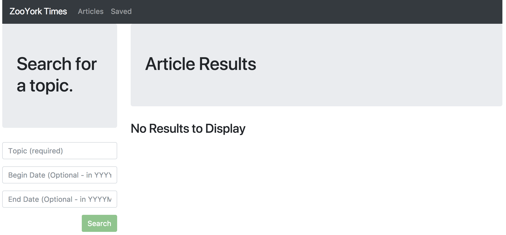

# thenewnewtimes
Final Project for CS 655: The NewNew Times

# The NewNew Times :newspaper::apple::statue_of_liberty:
A `NodeJS`, `MongoDB`, `Express`, and `ReactJS` application where users can query, display, and save articles from the [New York Times Article Search API](http://developer.nytimes.com/). Users can remove saved articles as well.

**Live Demo**: https://zooyorktimes-scraper.herokuapp.com/ (NEEDS TO BE UPDATED!)



Click on the headlines to be re-directed to the full New York Times articles.

## Functionality
On the backend, the app uses `express` to serve routes and `mongoose` to interact with a `MongoDB` database.

On the frontend, the app uses `ReactJS` for rendering components, `axios` for internal/external API calls, and `bootstrap` as a styling framework.

In order to transpile the JSX code, `webpack` and `babel` were utilized. All of the JSX  code in the `/app` folder was transpiled into the `bundle.js` file located in the `/public` folder.

## New York Times API
Prior to starting this app and getting an `unnecessary` error message, you'll probably want to swap out the API Key provided in the `client/src/utils/API.js` file. 

To get a New York Times API Key, visit [this link](https://developer.nytimes.com/signup).

## Quickstart

```
  git clone git@github.com:wrainaud/ZooYorkTimes-Scraper.git my-app
  cd my-app
  yarn install
  cd client
  yarn install
  cd ..
  yarn start
```

## Quickstop

```
  ^C
  ^C
```

**Note : Please make sure your MongoDB is running.** For MongoDB installation guide see [this](https://docs.mongodb.org/v3.0/installation/). 
Run the following command in Terminal to start MongoDB after installation
```
  brew services start mongodb-community@4.4
```

Run the following command in Terminal to stop MongoDB
```
  brew services start mongodb-community@4.4
```

Also `npm3` is required to install dependencies properly.

Support
-------

Please [open an issue](https://github.com/wrainaud/cs655-final-project/new) for support.

Contributing
-------

Please contribute using [Github Flow](https://guides.github.com/introduction/flow/). Create a branch, add commits, and [open a pull request](https://github.com/wrainaud/cs655-final-project/compare/).

License
-------

The MIT License (MIT)

Copyright (c) 2021 William J. Rainaud

Permission is hereby granted, free of charge, to any person obtaining a copy of this software and associated documentation files (the "Software"), to deal in the Software without restriction, including without limitation the rights to use, copy, modify, merge, publish, distribute, sublicense, and/or sell copies of the Software, and to permit persons to whom the Software is furnished to do so, subject to the following conditions:

The above copyright notice and this permission notice shall be included in all copies or substantial portions of the Software.

THE SOFTWARE IS PROVIDED "AS IS", WITHOUT WARRANTY OF ANY KIND, EXPRESS OR IMPLIED, INCLUDING BUT NOT LIMITED TO THE WARRANTIES OF MERCHANTABILITY, FITNESS FOR A PARTICULAR PURPOSE AND NONINFRINGEMENT. IN NO EVENT SHALL THE AUTHORS OR COPYRIGHT HOLDERS BE LIABLE FOR ANY CLAIM, DAMAGES OR OTHER LIABILITY, WHETHER IN AN ACTION OF CONTRACT, TORT OR OTHERWISE, ARISING FROM, OUT OF OR IN CONNECTION WITH THE SOFTWARE OR THE USE OR OTHER DEALINGS IN THE SOFTWARE.  
